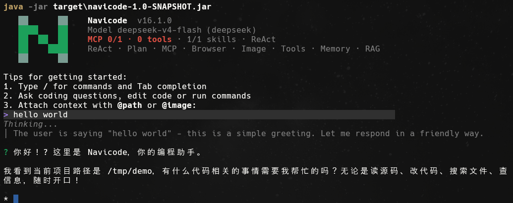

# Navicode

Navicode 是一个面向代码库工作的 Java Agent CLI。它把 ReAct、Plan-and-Execute、多 Agent 协作、长期记忆、RAG 代码检索、MCP、HITL 审批、Side-Git 快照和终端内联 TUI 放在同一个本地命令行工具里，目标是提供接近 Claude Code 形态的可控编码 Agent。



## 当前状态

项目仍处于快速迭代阶段，适合本地研究、二次开发和功能验证。默认安全模型是“本地执行 + 路径围栏 + 危险命令拦截 + 人工审批 + 审计日志”，不是容器或虚拟机沙箱。

已实现的主线能力：

- ReAct Agent：默认对话与工具调用模式。
- Plan-and-Execute：通过 `/plan` 先规划再执行复杂任务。
- Multi-Agent：通过 `/team` 使用 Planner / Worker / Reviewer 协作。
- Memory：长期记忆、工作区记忆、结构化 checkpoint、`/goal` 停止条件和保守版 `/dream`。
- RAG：代码分块、Embedding、SQLite 向量存储、语义检索和代码关系查询。
- MCP：支持 stdio 与 Streamable HTTP server，工具名映射为 `mcp__{server}__{tool}`。
- Web：`web_search` / `web_fetch`，并支持时效性问题的联网预检。
- Browser：通过 Chrome DevTools MCP 连接 isolated 或已登录 Chrome。
- HITL：危险工具审批、路径策略、命令策略和 JSONL 审计。
- Side-Git：每轮任务前后维护独立快照，可用 `revert_turn` 回滚。
- Runtime API：本地 HTTP/SSE 接口，面向无头集成场景。
- WeChat Bridge：个人微信远程控制的本地桥接骨架，走独立 Node daemon + Runtime API，不把微信 SDK 逻辑塞进主 CLI。
- 图片输入：支持 `@image:`、剪贴板图片和支持视觉能力的模型。
- Inline TUI：JLine 输入、高亮、补全、底部状态栏、工具块和 diff 展示。

## 环境要求

- Java 17+
- Maven
- 可选：Node.js 18+，用于 `integrations/wechat-bridge/` 本地微信桥接。
- 可选：`ripgrep`，`grep_code` 会优先使用它，未安装时回退 Java 扫描。
- 至少一个模型 API Key：`GLM_API_KEY`、`DEEPSEEK_API_KEY`、`STEP_API_KEY`、`KIMI_API_KEY` / `MOONSHOT_API_KEY`、`FREELLMAPI_API_KEY`。
- 如需 RAG：默认需要本地 Ollama embedding 服务，或配置其他 embedding provider。

## 快速启动

```bash
cp .env.example .env
# 编辑 .env，填入至少一个模型 API Key

mvn clean package
java -jar target/navicode-1.0-SNAPSHOT.jar
```

Windows PowerShell 可直接使用同样的 Maven 和 Java 命令：

```powershell
Copy-Item .env.example .env
mvn clean package
java -jar target/navicode-1.0-SNAPSHOT.jar
```

`mvn clean package` 默认跳过测试，优先产出可手工验收的 fat jar。需要跑回归时使用：

```bash
mvn test -Pquick -DskipTests=false
```

## 模型配置

Navicode 会按以下顺序读取 API Key：

1. `~/.navicode/config.json`
2. 环境变量
3. 项目根目录 `.env`
4. 用户主目录 `.env`

支持的 provider 与常用变量：

| Provider | 变量 | 默认模型 |
|---|---|---|
| GLM | `GLM_API_KEY`, `GLM_MODEL` | `glm-5.1` |
| DeepSeek | `DEEPSEEK_API_KEY`, `DEEPSEEK_MODEL` | `deepseek-v4-flash` |
| StepFun | `STEP_API_KEY`, `STEP_MODEL`, `STEP_BASE_URL` | `step-3.5-flash` |
| Kimi / Moonshot | `KIMI_API_KEY` / `MOONSHOT_API_KEY`, `KIMI_MODEL` | `kimi-k2.6` |
| FreeLLMAPI | `FREELLMAPI_API_KEY`, `FREELLMAPI_BASE_URL` | `auto` |

运行中可切换模型：

```text
/model
/model glm-5.1
/model glm-5v-turbo
/model deepseek
/model step
/model kimi
/model freellmapi
```

## 常用命令

| 命令 | 作用 |
|---|---|
| `/plan <任务>` | 使用 Plan-and-Execute 执行当前任务 |
| `/team <任务>` | 使用多 Agent 协作执行当前任务 |
| `/clear` | 清空当前会话短期上下文 |
| `/history clear` | 清空本机输入历史 |
| `/hitl on` / `/hitl off` | 开启或关闭危险操作人工审批 |
| `/policy` | 查看路径、命令和审计策略状态 |
| `/audit [N]` | 查看最近审计日志 |
| `/index [路径]` | 建立代码 RAG 索引 |
| `/search <问题>` | 对代码库做语义检索 |
| `/graph <问题>` | 查询代码关系图 |
| `/context` / `/ctx` | 查看上下文预算状态 |
| `/memory` | 查看记忆系统状态 |
| `/save <内容>` | 保存长期记忆 |
| `/memory list` | 查看长期记忆 |
| `/memory search <关键词>` | 搜索长期记忆 |
| `/memory delete <id>` | 删除单条长期记忆 |
| `/memory clear` | 清空长期记忆 |
| `/goal` | 查看当前长任务目标 |
| `/goal set <目标>` | 设置长任务停止条件 |
| `/goal clear` | 清除当前长任务目标 |
| `/dream` | 生成候选 `MEMORY.md` 建议稿，不自动写入 |
| `/task` | 查看后台任务列表 |
| `/task add <任务>` | 提交后台任务 |
| `/task board [--all]` | 查看树状工作任务板 |
| `/task new <摘要>` | 创建工作任务 |
| `/task sub <parent_id> <摘要>` | 创建子任务 |
| `/task start\|block\|done\|abandon <id>` | 更新工作任务状态 |
| `/task gate` | 检查未完成工作任务 |
| `/snapshot` | 查看 Side-Git 快照 |
| `/snapshot status` | 查看快照状态 |
| `/snapshot clean` | 清理当前项目快照 |
| `/restore <id>` | 从快照恢复 |
| `/mcp` | 查看 MCP server 状态 |
| `/mcp restart <name>` | 重启 MCP server |
| `/mcp logs <name>` | 查看 MCP 日志 |
| `/mcp resources <name>` | 查看 MCP resources |
| `/browser` | 查看浏览器会话状态 |
| `/browser connect` | 连接已允许远程调试的 Chrome |
| `/browser connect <port>` | 连接旧式 CDP 端口 |
| `/browser disconnect` | 切回 isolated 浏览器模式 |
| `/skill` | 查看 Skill 列表 |
| `/skill show <name>` | 查看 Skill 内容 |
| `/skill on <name>` / `/skill off <name>` | 启用或禁用 Skill |
| `/config` | 查看或更新本地配置 |

## 内置工具

Agent 可调用的核心工具包括：

- 文件与目录：`read_file`、`write_file`、`list_dir`
- 代码定位：`glob_files`、`grep_code`
- 命令执行：`execute_command`
- 项目创建：`create_project`
- 代码语义检索：`search_code`
- 联网：`web_search`、`web_fetch`
- 快照恢复：`revert_turn`
- MCP 动态工具：`mcp__{server}__{tool}`

代码库问题默认优先走 `glob_files` / `grep_code` / `read_file` 做实时精确定位；`search_code` 是语义辅助检索，不替代精确搜索。

## 图片输入

Navicode 支持把图片作为真实 LLM content block 发送，而不是只把路径或截图结果转成文字占位：

- 本地图片：`@image:<./shot.png>`、`@image:file:///abs/path.png`、`@image:<file:///path with spaces.png>`。
- 剪贴板：输入 `@clipboard`，或在 inline 终端里按 Ctrl+V 把系统剪贴板图片保存到 `~/.navicode/cache/` 并注入 `@image:<path>`。
- MCP 截图：MCP 工具返回 `image content` 时，tool 文本保留 fallback，Navicode 会额外追加一条 user image message 给模型。
- 执行路径：ReAct、`/plan`、`/team` 都走同一套图片输入链路。
- 历史控制：旧历史里的 image payload 会替换成文本占位，只保留 Image source 等元信息，避免旧截图反复消耗上下文。

图片统一经过 `ImageProcessor`：只接受 `image/*`，透明图铺白底，大图缩放 / 压缩到 5MB base64 API 上限内，不做 OCR。输入层不按模型名提前拒绝图片；如果当前 provider 或模型不支持图片，应显示 provider 返回的真实错误。GLM 多模态可用 `/model glm-5v-turbo` 切换。

## 记忆系统

Navicode 把“当前会话上下文”和“跨会话稳定事实”分开管理：

- 当前会话短期上下文通过 `conversationHistory` 作为 message history 进入模型。
- 长期记忆通过 `/save` 或明确记忆意图写入，并在 system prompt 中检索注入。
- 工作区可见记忆写在 `.navicode/memory/` 下，便于恢复任务上下文。
- `checkpoint.md` 是结构化恢复状态，包含 Current Goal、Completed、In Progress、Blockers、Key Files、Verification Commands、Next Steps、Work Tasks。
- `/goal set <目标>` 会持久化长任务目标；ReAct 正常结束前会用 judge LLM 判断 `complete`、`continue` 或 `blocked`。
- `/dream` 只生成候选记忆建议稿或 diff，默认不自动修改长期记忆。

默认记忆检索模式是安全路径：

```bash
NAVICODE_MEMORY_RETRIEVAL=long_term_only
```

实验模式允许额外检索短期摘要，但会跳过当前 query 和 active history 中已有内容：

```bash
NAVICODE_MEMORY_RETRIEVAL=long_plus_short
# 或
java -Dnavicode.memory.retrieval=long_plus_short -jar target/navicode-1.0-SNAPSHOT.jar
```

## RAG 与代码检索

RAG 默认配置：

```bash
EMBEDDING_PROVIDER=ollama
EMBEDDING_MODEL=nomic-embed-text:latest
EMBEDDING_BASE_URL=http://localhost:11434
```

使用流程：

```text
/index
/search 这个项目的记忆系统怎么组织
/graph Agent 调用 ToolRegistry 的路径
```

索引默认存储在 `~/.navicode/rag/codebase.db`，可通过 `-Dnavicode.rag.dir` 覆盖。

## MCP 与浏览器

MCP 配置兼容 Claude Code 风格：

- 用户级：`~/.navicode/mcp.json`
- 项目级：`.navicode/mcp.json`

项目级配置会按 server 名覆盖用户级配置。`command` + `args` 表示 stdio server，`url` + `headers` 表示 Streamable HTTP server。

首次启动时，Navicode 会建议配置 `chrome-devtools` MCP：

```json
{
  "mcpServers": {
    "chrome-devtools": {
      "command": "npx",
      "args": ["-y", "chrome-devtools-mcp@latest", "--isolated=true"]
    }
  }
}
```

需要复用已登录 Chrome 时，可在 Chrome 144+ 的 `chrome://inspect/#remote-debugging` 勾选允许远程调试，然后执行：

```text
/browser connect
```

## Runtime API

无头模式示例：

```bash
NAVICODE_RUNTIME_API_KEY=test java -jar target/navicode-1.0-SNAPSHOT.jar serve --http --port 8080
```

Runtime API 只监听 `127.0.0.1`，并要求 API Key。

当前端点：

- `POST /v1/threads`
- `POST /v1/threads/{id}/turns`
- `POST /v1/threads/{id}/cancel`
- `GET /v1/threads/{id}/events`

`POST /v1/threads/{id}/turns` 支持 `input` 和可选 `cwd`。同一个 Runtime thread 会复用会话状态，并按 thread 串行执行 turn，适合微信、脚本或其他本地守护进程连续调用。

事件流面向桥接层消费，当前包括：

- `thread.created`
- `turn.queued`
- `turn.started`
- `message.delta`
- `tool.calls`
- `diff.summary`
- `approval.required`
- `turn.completed`
- `turn.failed`
- `turn.cancelled`

## 微信个人号桥接

Navicode 已加入个人微信接入的基础链路：

```text
微信个人号
  <-> ilink Bot API
  <-> Navicode WeChat Bridge daemon
  <-> Navicode Runtime API
  <-> Agent.run(...)
```

桥接层放在 `integrations/wechat-bridge/`，是独立 TypeScript/Node 项目。当前已实现：

- Runtime API client：创建 thread、提交 turn、读取 SSE events、取消 turn。
- Thread map：把微信用户映射到 Runtime thread，保留连续会话。
- Message splitter：把长回复按微信消息长度分段。
- Command router：`/help`、`/status`、`/clear`、`/stop`、`/cwd`。
- Mock 文本闭环测试：提交文本 turn、读取 `message.delta`、分段输出。

启动顺序：

```powershell
$env:NAVICODE_RUNTIME_API_KEY = "your-local-key"
java -jar target/navicode-1.0-SNAPSHOT.jar serve --http --port 8080

cd integrations/wechat-bridge
npm install
npm test
```

当前桥接层已包含 ilink 二维码登录、账号保存、`getupdates` 长轮询、文本发送、typing、直连媒体下载和本地文件上传 helper。先执行 `npm start -- setup` 扫码绑定，再执行 `npm start -- start` 启动桥接。仍未完成的是无直连 URL 的加密 CDN 媒体解密、daemon 脚本、自动回传生成文件和真实微信账号端到端验收。这个方案用于个人远程控制本机 Navicode，不等同于公众号或企业微信生产集成。详细说明见 [docs/wechat-bridge.md](docs/wechat-bridge.md)。

## 数据落盘位置

| 数据 | 默认路径 |
|---|---|
| 用户配置 | `~/.navicode/config.json` |
| 长期记忆 | `~/.navicode/memory/long_term_memory.json` |
| 工作区记忆 | `.navicode/memory/` |
| RAG 索引 | `~/.navicode/rag/codebase.db` |
| 输入历史 | `~/.navicode/history/input.history` |
| 审计日志 | `~/.navicode/audit/audit-YYYY-MM-DD.jsonl` |
| Side-Git 快照 | `~/.navicode/snapshots/<project_hash>/<worktree_hash>/.git` |
| Runtime API 数据 | `~/.navicode/runtime/` |
| 微信桥接账号、会话、下载与日志 | `~/.navicode/wechat/` |
| 后台任务 | `~/.navicode/tasks/tasks.db` |

`.env`、`.navicode/`、`target/` 已在 `.gitignore` 中排除，不应提交真实密钥、工作区记忆或构建产物。

## 开发验证

```bash
mvn test -Pquick -DskipTests=false
mvn test -Pphase16-smoke -DskipTests=false
mvn test -Dtest=CliCommandParserTest,MemoryManagerTest,MemoryRetrieverTest -DskipTests=false
```

常用定位：

| 场景 | 命令 |
|---|---|
| CLI 命令解析 | `mvn test -Dtest=CliCommandParserTest,MainInputNormalizationTest -DskipTests=false` |
| Memory | `mvn test -Dtest=MemoryManagerTest,MemoryRetrieverTest,WorkspaceMemoryTest,GoalManagerTest -DskipTests=false` |
| RAG | `mvn test -Dtest=CodeChunkerTest,CodeAnalyzerTest,VectorStoreTest,CodeIndexTest -DskipTests=false` |
| 工具与策略 | `mvn test -Dtest=ToolRegistryTest,CodeSearchGoldenSetTest,ApprovalPolicyTest -DskipTests=false` |
| TUI | `mvn test -Pphase16-smoke -DskipTests=false` |
| Runtime API | `mvn test -Dtest=RuntimeApiServerTest -DskipTests=false` |
| WeChat Bridge | `cd integrations/wechat-bridge && npm test` |

## 目录结构

```text
src/main/java/com/navicode/
├── agent/       ReAct、PlanExecute、SubAgent、AgentOrchestrator
├── cli/         CLI 入口、命令解析、补全、高亮、历史
├── config/      本地配置读取
├── context/     上下文 profile 与 token 统计
├── hitl/        人工审批与审批状态
├── image/       图片引用与处理
├── llm/         多 provider LLM client
├── lsp/         Java 语法诊断注入
├── mcp/         MCP client、server manager、transport、resource
├── memory/      长期记忆、短期上下文、checkpoint、goal、dream
├── plan/        计划和 DAG
├── policy/      路径围栏、命令策略、审计
├── prompt/      prompt 分层组装
├── rag/         代码索引、向量库、语义检索
├── render/      Inline / Plain renderer
├── runtime/     Runtime API 与后台任务
├── skill/       Skill 扫描、索引、加载
├── snapshot/    Side-Git 快照
├── tool/        内置工具注册与执行
├── tui/         Lanterna TUI
├── util/        Markdown 渲染、ANSI、分词工具
└── web/         搜索、抓取、正文提取、网络策略
```

## 参考文档

- [AGENTS.md](AGENTS.md)：给 Agent / 新线程的首读入口。
- [docs/agents-reference.md](docs/agents-reference.md)：详细功能行为、配置读取顺序和实现约束。
- [ROADMAP.md](ROADMAP.md)：阶段演进路线图。
- [docs/phase-20-runtime-api.md](docs/phase-20-runtime-api.md)：后台任务与 Runtime API。
- [docs/wechat-bridge.md](docs/wechat-bridge.md)：个人微信桥接架构、启动方式、安全边界和后续项。
- [docs/phase-22-jline-interaction-upgrade.md](docs/phase-22-jline-interaction-upgrade.md)：JLine 交互升级。
